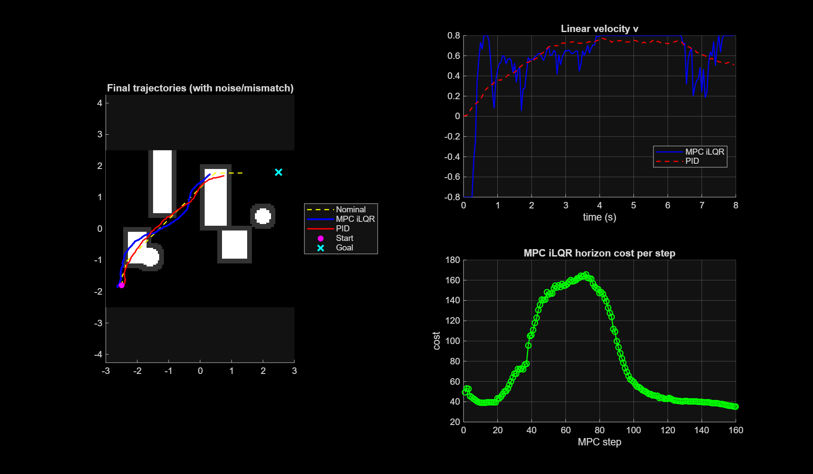

# Hybrid A* and MPC-iLQR for Robust Differential-Drive Robot Navigation

> A complete planning and control pipeline for differential-drive robot navigation in cluttered environments, combining Hybrid A* global path planning with MPC-iLQR local trajectory tracking under actuator noise, velocity mismatch, and heading drift.

**Course:** ECE 592 · NC State University  
---

## Why This Project

Classical controllers like PID react only to instantaneous error. They have no awareness of upcoming obstacles, turns, or accumulated drift. In cluttered environments with model mismatch and additive noise, this reactive approach causes corner-cutting, wall-grazing, and steady-state error that never fully resolves.

This project builds a full navigation stack that addresses this: Hybrid A* provides a globally feasible, kinematically consistent path, and MPC-iLQR tracks it in real time — anticipating turns, softly penalizing proximity to obstacles, and replanning automatically when disturbances push the robot too far off course.

---

## Key Results

| Metric | MPC-iLQR | PID |
|---|---|---|
| Position RMSE | 0.997 | 0.779 |
| Control Effort | 210.575 | 142.797 |
| Obstacle Awareness | Predictive (soft costs) | Reactive only |
| Behavior Near Turns | Anticipatory corrections | Smooth but drifts |
| Robustness to Mismatch | Strong — continuous reoptimization | Accumulates drift |

PID achieves lower RMSE by cutting corners rather than following the nominal path. MPC-iLQR uses more control effort but maintains a safer, more intentional trajectory, especially near obstacles and tight turns.

**Overall:** MPC-iLQR > PID in robustness, obstacle awareness, and disturbance rejection. PID > MPC-iLQR in control smoothness and energy efficiency.

---

## Results

### Final Trajectories Under Noise and Mismatch



MPC-iLQR (blue) stays tighter to the nominal Hybrid A* path (yellow dashed), especially through narrow corridors. PID (red) drifts outward in reactive regions. Both reach the goal, but MPC-iLQR makes fewer large corrections and is gently biased away from walls by soft obstacle costs.

The velocity plot (top right) shows MPC-iLQR making aggressive early adjustments to align with the nominal heading, while PID ramps up smoothly but accumulates drift. The MPC horizon cost (bottom right) peaks between steps 40–80 as the robot navigates the most congested region, then drops as open space is reached; confirming the controller is sensitive to environmental complexity.

---

## System Overview

```
Occupancy Grid Map
        |
        v
+-------------------+
|   Hybrid A*       |  Global planner: 8-connected grid + discrete heading bins
|   Global Planner  |  Obstacle inflation for robot footprint
+--------+----------+
         |
         v  (112 waypoints -> dense interpolated trajectory)
+-------------------+
|   MPC-iLQR        |  Receding-horizon controller (N steps ahead)
|   Local Controller|  iLQR backward Riccati pass + forward rollout
|                   |  Soft obstacle costs + control-rate penalties
|                   |  Auto-replanning on large tracking error
+--------+----------+
         |
         v
+-------------------+
|   Simulated Robot |  Actuator lag + velocity scaling mismatch
|   (Diff-Drive)    |  Heading bias + additive Gaussian noise
+-------------------+
```

---

## Features

- **Hybrid A* global planner** — 8-connected grid search over (x, y, θ) state space with discrete heading bins; nonholonomic motion primitives; obstacle inflation for robot footprint
- **MPC-iLQR local controller** — receding-horizon optimization using iterative LQR; backward Riccati pass + line-search forward rollout
- **Soft obstacle avoidance** — exponential penalty `c_obs(x) = exp(-d(x)/σ)` biases trajectory away from walls without hard constraints
- **Automatic replanning** — triggers a new Hybrid A* call when tracking error exceeds a threshold
- **Realistic disturbance model** — velocity scaling mismatch, heading bias, actuator lag, and additive Gaussian state noise
- **PID baseline** — proportional position and heading controller for direct comparison

---

## Experimental Setup

**Environment:** 2D occupancy grid with rectangular and circular obstacles; obstacles inflated by `r_infl = r_robot + r_margin` for collision safety.

**Robot model:** Differential-drive with state `(x, y, θ)` and controls `(v, ω)`.

**Disturbance model:**
- Velocity mismatch: `v_true = α_v · v`
- Heading bias: `ω_true = ω + b_θ`
- Process noise: `w_t ~ N(0, Σ)`

**MPC-iLQR parameters:**

| Parameter | Value |
|---|---|
| Horizon N | 20 steps |
| State cost Q | Diagonal |
| Terminal cost Q_f | Diagonal |
| Control cost R | Diagonal |
| Obstacle penalty σ | Tuned per map |
| iLQR iterations | 5 per MPC step |

**PID parameters:**
- `v = K_p · ‖x_nom - x‖`
- `ω = K_θ · (atan2(y_nom - y, x_nom - x) - θ)`

---

## Project Structure

```
Hybrid-Astar-MPC-iLQR-Navigation/
|
|-- ilqr_diff_drive_upgrade_FINAL.m    # Full pipeline: planner + controller + simulation
|-- final_summary_ilqr_mpc_noise.png   # Trajectory, velocity, and cost summary figure
|-- ECE_592_Project_Report.pdf         # Full project report
`-- README.md
```

---

## Running the Code

**Requirements:** MATLAB (R2021a or later, no additional toolboxes required)

```matlab
% In MATLAB, navigate to the project folder and run:
ilqr_diff_drive_upgrade_FINAL()
```

The script runs the full pipeline: Hybrid A* planning → nominal trajectory interpolation → MPC-iLQR and PID simulation under noise → figure generation. Runtime is approximately 1–3 minutes.

---

## Tech Stack

| Tool | Role |
|---|---|
| MATLAB | Full simulation and control implementation |
| Hybrid A* | Global path planning over (x, y, θ) lattice |
| iLQR | Nonlinear MPC via iterative linearization |
| Occupancy Grid | Environment representation and collision checking |

---

## Relation to Theory

- **Hybrid A*** extends classical A* to nonholonomic systems by adding a discrete heading dimension — enabling kinematically feasible path generation without full trajectory simulation during search
- **iLQR** approximates nonlinear MPC through repeated linearization around the current rollout, making receding-horizon control computationally tractable for real-time robotics
- **Soft obstacle costs** via exponential distance penalties encode safety without hard constraints, consistent with penalty-based MPC formulations
- **Disturbance rejection** through continuous re-linearization on the actual robot state — rather than the nominal model — allows MPC-iLQR to compensate for mismatch without explicit disturbance estimation
